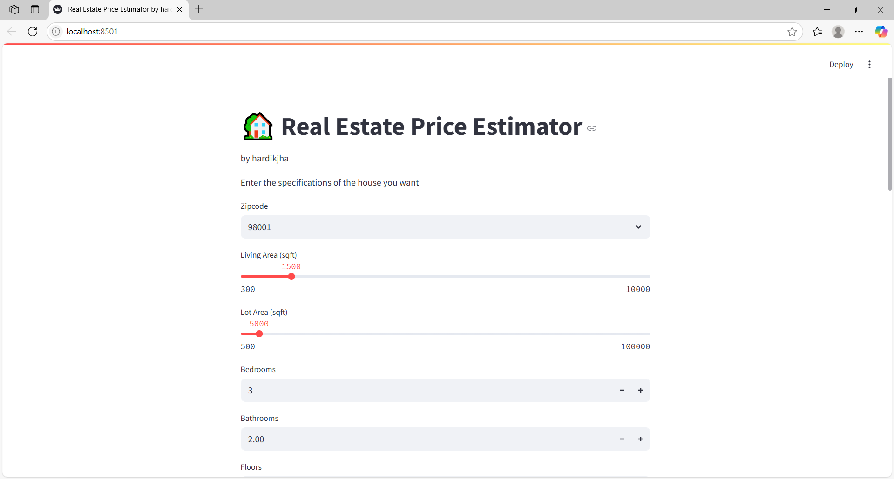
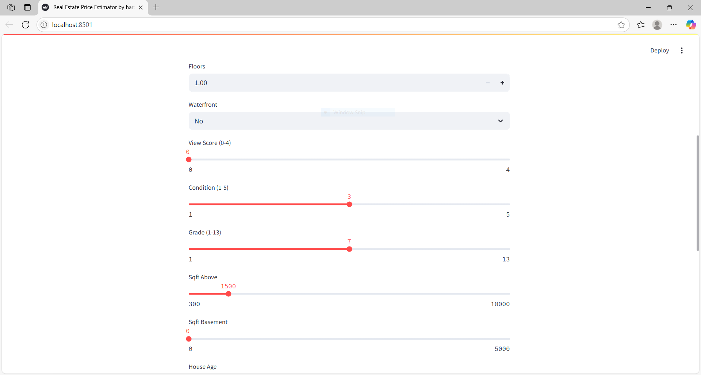
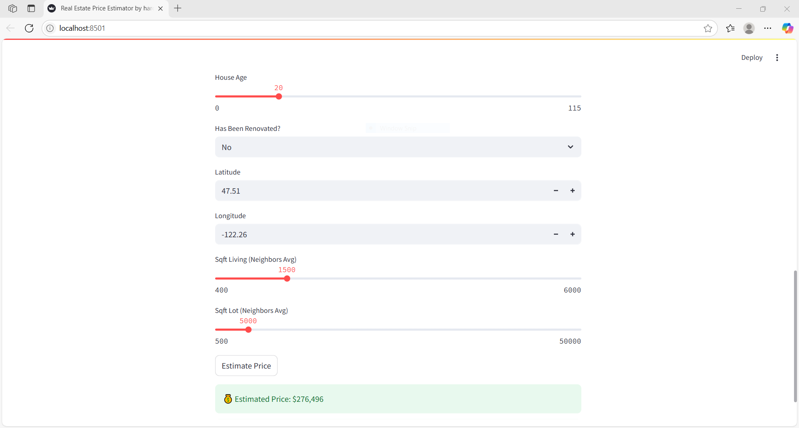

#Real Estate Price Estimator (based on Kings County, CA)

A machine learning-based web application that predicts the price of a house based on its features like location, number of bedrooms, bathrooms, square footage, and more.

##Features
-Predicts house prices based on multiple parameters
-Trained on real-world housing data
-Option to retrain the model with new data
-Clean and simple UI using Streamlit

##Demo

